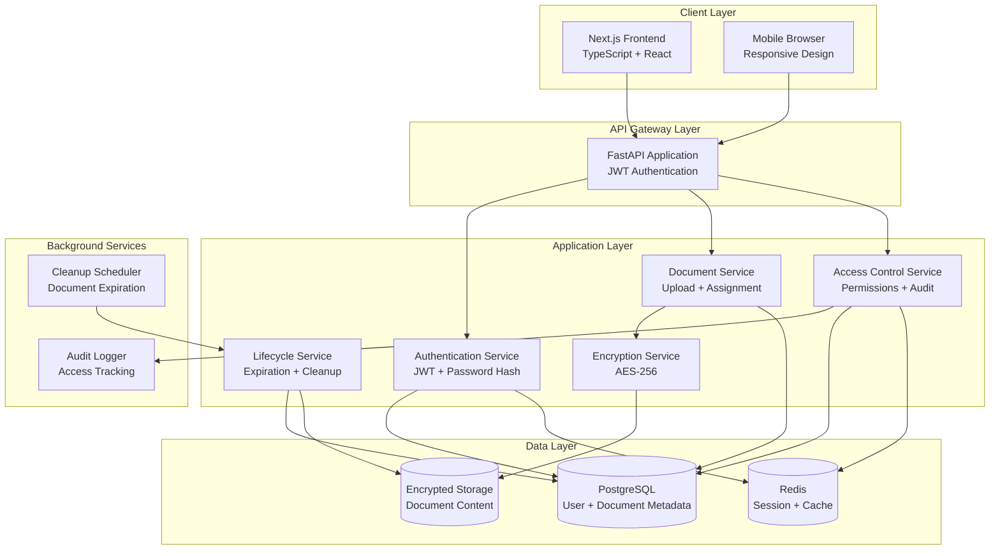
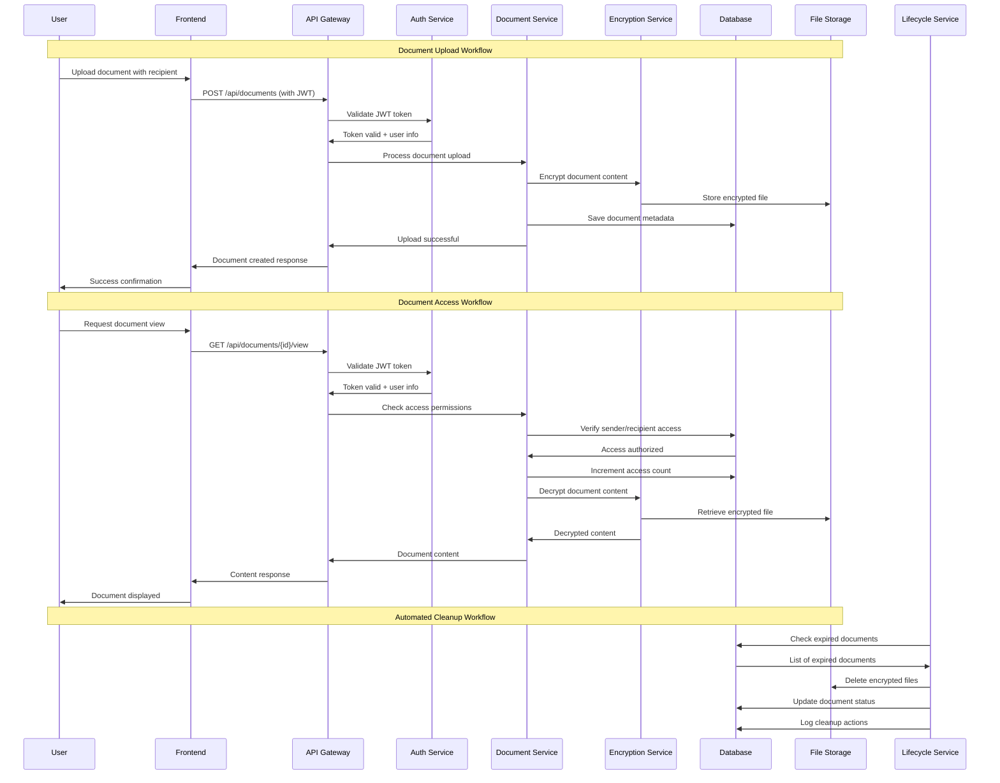

# Secure Document Delivery System Fullstack Architecture Document

## Introduction

This document outlines the complete fullstack architecture for the Secure Document Delivery System, including backend systems, frontend implementation, and their integration. It serves as the single source of truth for AI-driven development, ensuring consistency across the entire technology stack with a primary focus on security, encryption, and controlled document access.

This unified approach combines backend security architecture with frontend user experience, streamlining the development process for this security-critical application where data protection and access control are paramount.

### Starter Template or Existing Project
**N/A - Greenfield project** with custom monorepo structure optimized for security and development efficiency.

### Change Log
| Date | Version | Description | Author |
|------|---------|-------------|---------|
| Today | 1.0 | Initial fullstack architecture creation | Architect (Winston) |

## High Level Architecture

### Technical Summary
The Secure Document Delivery System employs a monolithic fullstack architecture within a monorepo structure, featuring Next.js frontend with TypeScript and Python FastAPI backend. The system implements AES-256 encryption for document storage, JWT-based authentication, and automated document lifecycle management. Key architectural patterns include Repository pattern for data access, middleware-based security enforcement, and scheduled background jobs for compliance automation. The architecture prioritizes security through defense-in-depth principles while maintaining developer productivity through clear separation of concerns and comprehensive API design.

### Platform and Infrastructure Choice
**Platform:** Cloud-agnostic design with Docker containerization
**Key Services:** PostgreSQL database, Redis for caching and job queues, object storage for encrypted documents
**Deployment Host and Regions:** Multi-region deployment capability with primary focus on corporate data center or private cloud

### Repository Structure
**Structure:** Monorepo with npm workspaces
**Monorepo Tool:** npm workspaces with custom scripts for development workflow
**Package Organization:** Clear separation between frontend app, backend API, shared types, and infrastructure configuration

### High Level Architecture Diagram


### Architectural Patterns
- **Monolithic Architecture:** Single deployable unit for simplified security and operational management - _Rationale:_ Enables consistent security enforcement and simplified deployment for internal corporate use
- **Repository Pattern:** Abstract data access logic with consistent interfaces - _Rationale:_ Enables comprehensive testing and future database migration flexibility while maintaining security
- **Middleware-Based Security:** Layered security validation at API boundaries - _Rationale:_ Provides defense-in-depth security with consistent authentication and authorization
- **Event-Driven Background Processing:** Asynchronous document lifecycle management - _Rationale:_ Ensures automated compliance and cleanup without blocking user operations
- **API-First Design:** RESTful API with OpenAPI documentation - _Rationale:_ Enables clear frontend-backend contracts and potential future integrations

## Tech Stack

### Technology Stack Table

| Category | Technology | Version | Purpose | Rationale |
|----------|------------|---------|---------|-----------|
| **Frontend Language** | TypeScript | 5.3.3 | Type-safe frontend development | Strong typing prevents runtime errors in security-critical code |
| **Frontend Framework** | Next.js | 14.0.4 | React-based frontend with SSR | Optimal performance, SEO, and developer experience |
| **UI Component Library** | Tailwind CSS | 3.4.0 | Utility-first styling framework | Consistent design system with security-focused components |
| **State Management** | React Context + useReducer | Built-in | Application state management | Sufficient for app complexity, reduces dependencies |
| **Backend Language** | Python | 3.11.6 | High-performance backend development | Excellent security libraries and async capabilities |
| **Backend Framework** | FastAPI | 0.104.1 | Modern async Python web framework | Auto-generated docs, excellent performance, type safety |
| **API Style** | REST | OpenAPI 3.0 | RESTful API with documentation | Clear contracts, industry standard, security best practices |
| **Database** | PostgreSQL | 15.4 | Primary data storage | ACID compliance, excellent security features, JSON support |
| **Cache** | Redis | 7.2.3 | Session storage and caching | High-performance caching and session management |
| **File Storage** | Local Filesystem | Native | Encrypted document storage | Simplified deployment, full control over encryption |
| **Authentication** | JWT + bcrypt | PyJWT 2.8.0 | Stateless authentication | Secure, scalable authentication for API access |
| **Frontend Testing** | Jest + React Testing Library | 29.7.0 | Component and unit testing | Comprehensive testing for security-critical UI components |
| **Backend Testing** | pytest + pytest-asyncio | 7.4.3 | API and service testing | Excellent Python testing with async support |
| **E2E Testing** | Playwright | 1.40.0 | End-to-end workflow testing | Full user journey testing including security flows |
| **Build Tool** | npm | 10.2.3 | Package management and scripts | Standard Node.js ecosystem tooling |
| **Bundler** | Next.js built-in | Webpack 5 | Frontend asset bundling | Optimized bundling with built-in optimizations |
| **IaC Tool** | Docker Compose | 2.23.0 | Development environment | Consistent development and deployment environments |
| **CI/CD** | GitHub Actions | Latest | Automated testing and deployment | Integrated security scanning and deployment pipeline |
| **Monitoring** | Python logging + APM | Built-in | Application monitoring | Comprehensive logging for security audit and debugging |
| **Logging** | Winston (Frontend) + Python logging | Latest | Structured application logging | Security audit trails and debugging support |
| **CSS Framework** | Tailwind CSS | 3.4.0 | Utility-first styling | Consistent design system with security-focused styling |

## Data Models

### User Model
**Purpose:** Represents authenticated users who can send and receive documents

**Key Attributes:**
- id: UUID - Primary identifier for user
- email: String - Unique email address for authentication
- password_hash: String - bcrypt hashed password
- created_at: DateTime - Account creation timestamp
- updated_at: DateTime - Last modification timestamp
- is_active: Boolean - Account status flag

#### TypeScript Interface
```typescript
interface User {
  id: string;
  email: string;
  created_at: string;
  updated_at: string;
  is_active: boolean;
  // password_hash excluded from frontend interfaces
}

interface CreateUserRequest {
  email: string;
  password: string;
}

interface LoginRequest {
  email: string;
  password: string;
}

interface AuthResponse {
  access_token: string;
  token_type: string;
  user: User;
}
```

#### Relationships
- One-to-many with Document (as sender)
- One-to-many with Document (as recipient)
- One-to-many with DocumentAccess (access history)

### Document Model
**Purpose:** Stores encrypted document content and metadata with access controls

**Key Attributes:**
- id: UUID - Primary document identifier
- title: String - User-provided document title
- description: String - Optional document description
- sender_id: UUID - Foreign key to User (document owner)
- recipient_id: UUID - Foreign key to User (document recipient)
- encrypted_content: Text - AES-256 encrypted document content
- encryption_key_id: String - Reference to encryption key
- view_limit: Integer - Maximum allowed views (optional)
- access_count: Integer - Current view count
- expires_at: DateTime - Document expiration date (optional)
- status: Enum - Document status (active, expired, view_exhausted, deleted)
- created_at: DateTime - Document creation timestamp
- updated_at: DateTime - Last modification timestamp

#### TypeScript Interface
```typescript
interface Document {
  id: string;
  title: string;
  description?: string;
  sender_id: string;
  recipient_id: string;
  view_limit?: number;
  access_count: number;
  expires_at?: string;
  status: 'active' | 'expired' | 'view_exhausted' | 'deleted';
  created_at: string;
  updated_at: string;
  // encrypted_content excluded from frontend
}

interface CreateDocumentRequest {
  title: string;
  description?: string;
  recipient_id: string;
  content: string; // base64 encoded
  view_limit?: number;
  expires_at?: string;
}

interface DocumentMetadata {
  id: string;
  title: string;
  sender: User;
  recipient: User;
  view_limit?: number;
  access_count: number;
  expires_at?: string;
  status: string;
  remaining_views?: number;
  time_until_expiration?: string;
}
```

#### Relationships
- Many-to-one with User (sender)
- Many-to-one with User (recipient)
- One-to-many with DocumentAccess (access history)

### DocumentAccess Model
**Purpose:** Audit trail for all document access attempts and security compliance

**Key Attributes:**
- id: UUID - Primary access record identifier
- document_id: UUID - Foreign key to Document
- user_id: UUID - Foreign key to User (accessor)
- access_type: Enum - Type of access (view, download, metadata)
- success: Boolean - Whether access was successful
- ip_address: String - Client IP address for security audit
- user_agent: String - Client browser information
- accessed_at: DateTime - Timestamp of access attempt

#### TypeScript Interface
```typescript
interface DocumentAccess {
  id: string;
  document_id: string;
  user_id: string;
  access_type: 'view' | 'download' | 'metadata';
  success: boolean;
  ip_address: string;
  user_agent: string;
  accessed_at: string;
}

interface AccessHistory {
  document_id: string;
  total_accesses: number;
  successful_accesses: number;
  recent_accesses: DocumentAccess[];
}
```

#### Relationships
- Many-to-one with Document
- Many-to-one with User

## API Specification

### REST API Specification

```yaml
openapi: 3.0.0
info:
  title: Secure Document Delivery API
  version: 1.0.0
  description: RESTful API for secure internal document sharing with encryption and access controls

servers:
  - url: http://localhost:8000/api/v1
    description: Development server
  - url: https://docs.company.com/api/v1
    description: Production server

components:
  securitySchemes:
    BearerAuth:
      type: http
      scheme: bearer
      bearerFormat: JWT

  schemas:
    User:
      type: object
      properties:
        id:
          type: string
          format: uuid
        email:
          type: string
          format: email
        created_at:
          type: string
          format: date-time
        updated_at:
          type: string
          format: date-time
        is_active:
          type: boolean

    Document:
      type: object
      properties:
        id:
          type: string
          format: uuid
        title:
          type: string
        description:
          type: string
        sender_id:
          type: string
          format: uuid
        recipient_id:
          type: string
          format: uuid
        view_limit:
          type: integer
          minimum: 1
          maximum: 10
        access_count:
          type: integer
        expires_at:
          type: string
          format: date-time
        status:
          type: string
          enum: [active, expired, view_exhausted, deleted]
        created_at:
          type: string
          format: date-time

    CreateDocumentRequest:
      type: object
      required:
        - title
        - recipient_id
        - content
      properties:
        title:
          type: string
          maxLength: 255
        description:
          type: string
          maxLength: 1000
        recipient_id:
          type: string
          format: uuid
        content:
          type: string
          format: base64
        view_limit:
          type: integer
          minimum: 1
          maximum: 10
        expires_at:
          type: string
          format: date-time

paths:
  /auth/login:
    post:
      summary: Authenticate user
      requestBody:
        required: true
        content:
          application/json:
            schema:
              type: object
              required:
                - email
                - password
              properties:
                email:
                  type: string
                  format: email
                password:
                  type: string
      responses:
        '200':
          description: Authentication successful
          content:
            application/json:
              schema:
                type: object
                properties:
                  access_token:
                    type: string
                  token_type:
                    type: string
                  user:
                    $ref: '#/components/schemas/User'

  /auth/register:
    post:
      summary: Register new user
      requestBody:
        required: true
        content:
          application/json:
            schema:
              type: object
              required:
                - email
                - password
              properties:
                email:
                  type: string
                  format: email
                password:
                  type: string
                  minLength: 8
      responses:
        '201':
          description: User created successfully

  /users/me:
    get:
      summary: Get current user profile
      security:
        - BearerAuth: []
      responses:
        '200':
          description: User profile
          content:
            application/json:
              schema:
                $ref: '#/components/schemas/User'

  /users:
    get:
      summary: List users for recipient selection
      security:
        - BearerAuth: []
      responses:
        '200':
          description: List of users
          content:
            application/json:
              schema:
                type: array
                items:
                  $ref: '#/components/schemas/User'

  /documents:
    post:
      summary: Upload new document
      security:
        - BearerAuth: []
      requestBody:
        required: true
        content:
          application/json:
            schema:
              $ref: '#/components/schemas/CreateDocumentRequest'
      responses:
        '201':
          description: Document uploaded successfully
          content:
            application/json:
              schema:
                $ref: '#/components/schemas/Document'

    get:
      summary: List user's documents
      security:
        - BearerAuth: []
      parameters:
        - name: type
          in: query
          schema:
            type: string
            enum: [sent, received, all]
          description: Filter documents by type
      responses:
        '200':
          description: List of documents
          content:
            application/json:
              schema:
                type: array
                items:
                  $ref: '#/components/schemas/Document'

  /documents/{document_id}:
    get:
      summary: Get document metadata
      security:
        - BearerAuth: []
      parameters:
        - name: document_id
          in: path
          required: true
          schema:
            type: string
            format: uuid
      responses:
        '200':
          description: Document metadata
          content:
            application/json:
              schema:
                $ref: '#/components/schemas/Document'

  /documents/{document_id}/view:
    get:
      summary: View document content
      security:
        - BearerAuth: []
      parameters:
        - name: document_id
          in: path
          required: true
          schema:
            type: string
            format: uuid
      responses:
        '200':
          description: Document content
          content:
            application/json:
              schema:
                type: object
                properties:
                  content:
                    type: string
                    format: base64
                  filename:
                    type: string
                  content_type:
                    type: string

  /documents/{document_id}/download:
    get:
      summary: Download document
      security:
        - BearerAuth: []
      parameters:
        - name: document_id
          in: path
          required: true
          schema:
            type: string
            format: uuid
      responses:
        '200':
          description: Document file
          content:
            application/octet-stream:
              schema:
                type: string
                format: binary

  /documents/{document_id}/access-history:
    get:
      summary: Get document access history
      security:
        - BearerAuth: []
      parameters:
        - name: document_id
          in: path
          required: true
          schema:
            type: string
            format: uuid
      responses:
        '200':
          description: Access history
          content:
            application/json:
              schema:
                type: array
                items:
                  type: object
                  properties:
                    user_id:
                      type: string
                    access_type:
                      type: string
                    success:
                      type: boolean
                    accessed_at:
                      type: string
                      format: date-time
```

## Components

### Authentication Service
**Responsibility:** Handle user authentication, JWT token management, and session security

**Key Interfaces:**
- POST /api/auth/login - User authentication with credentials
- POST /api/auth/register - New user registration
- GET /api/users/me - Current user profile retrieval

**Dependencies:** User repository, password hashing service, JWT service

**Technology Stack:** FastAPI with PyJWT, bcrypt for password hashing, Redis for session management

### Document Management Service
**Responsibility:** Handle document upload, encryption, storage, and metadata management

**Key Interfaces:**
- POST /api/documents - Document upload with encryption
- GET /api/documents - Document listing with filtering
- GET /api/documents/{id}/metadata - Document metadata retrieval

**Dependencies:** Encryption service, file storage, document repository, user repository

**Technology Stack:** FastAPI with SQLAlchemy, AES encryption library, local file system storage

### Access Control Service
**Responsibility:** Enforce document access permissions and maintain audit trails

**Key Interfaces:**
- GET /api/documents/{id}/view - Controlled document viewing
- GET /api/documents/{id}/download - Secure document download
- GET /api/documents/{id}/access-history - Access audit retrieval

**Dependencies:** Document repository, access audit repository, encryption service

**Technology Stack:** FastAPI middleware, SQLAlchemy for audit logging, Redis for caching

### Encryption Service
**Responsibility:** Handle AES-256 encryption and decryption of document content

**Key Interfaces:**
- encrypt_content(content: bytes) -> EncryptedContent
- decrypt_content(encrypted: EncryptedContent) -> bytes
- generate_key() -> EncryptionKey

**Dependencies:** Cryptography library, secure key storage

**Technology Stack:** Python cryptography library with Fernet encryption, environment-based key management

### Document Lifecycle Service
**Responsibility:** Automated document expiration and cleanup based on security rules

**Key Interfaces:**
- check_document_expiration() -> List[Document]
- cleanup_expired_documents() -> CleanupResult
- enforce_view_limits() -> List[Document]

**Dependencies:** Document repository, scheduler service, encryption service

**Technology Stack:** APScheduler for background jobs, SQLAlchemy for database operations

### Frontend Authentication Component
**Responsibility:** Handle user login, token storage, and authentication state management

**Key Interfaces:**
- LoginForm component with validation
- AuthContext for global authentication state
- ProtectedRoute component for route guarding

**Dependencies:** React Context, localStorage for token storage, API client

**Technology Stack:** React with TypeScript, Tailwind CSS for styling, React Hook Form for validation

### Frontend Document Management Component
**Responsibility:** Document upload, listing, and management user interface

**Key Interfaces:**
- DocumentUpload component with file handling
- DocumentList component with filtering and status display
- DocumentCard component for individual document display

**Dependencies:** File handling utilities, API client, authentication context

**Technology Stack:** React with TypeScript, Tailwind CSS, drag-and-drop file handling

## Core Workflows



## Database Schema

```sql
-- Users table
CREATE TABLE users (
    id UUID PRIMARY KEY DEFAULT gen_random_uuid(),
    email VARCHAR(255) UNIQUE NOT NULL,
    password_hash VARCHAR(255) NOT NULL,
    created_at TIMESTAMP WITH TIME ZONE DEFAULT NOW(),
    updated_at TIMESTAMP WITH TIME ZONE DEFAULT NOW(),
    is_active BOOLEAN DEFAULT true
);

-- Documents table
CREATE TABLE documents (
    id UUID PRIMARY KEY DEFAULT gen_random_uuid(),
    title VARCHAR(255) NOT NULL,
    description TEXT,
    sender_id UUID REFERENCES users(id) ON DELETE CASCADE,
    recipient_id UUID REFERENCES users(id) ON DELETE CASCADE,
    encrypted_content TEXT NOT NULL,
    encryption_key_id VARCHAR(255) NOT NULL,
    view_limit INTEGER CHECK (view_limit > 0 AND view_limit <= 10),
    access_count INTEGER DEFAULT 0,
    expires_at TIMESTAMP WITH TIME ZONE,
    status VARCHAR(20) DEFAULT 'active' CHECK (status IN ('active', 'expired', 'view_exhausted', 'deleted')),
    created_at TIMESTAMP WITH TIME ZONE DEFAULT NOW(),
    updated_at TIMESTAMP WITH TIME ZONE DEFAULT NOW()
);

-- Document access audit trail
CREATE TABLE document_access (
    id UUID PRIMARY KEY DEFAULT gen_random_uuid(),
    document_id UUID REFERENCES documents(id) ON DELETE CASCADE,
    user_id UUID REFERENCES users(id) ON DELETE CASCADE,
    access_type VARCHAR(20) NOT NULL CHECK (access_type IN ('view', 'download', 'metadata')),
    success BOOLEAN NOT NULL,
    ip_address INET,
    user_agent TEXT,
    accessed_at TIMESTAMP WITH TIME ZONE DEFAULT NOW()
);

-- Indexes for performance
CREATE INDEX idx_documents_sender ON documents(sender_id);
CREATE INDEX idx_documents_recipient ON documents(recipient_id);
CREATE INDEX idx_documents_status ON documents(status);
CREATE INDEX idx_documents_expires_at ON documents(expires_at);
CREATE INDEX idx_document_access_document ON document_access(document_id);
CREATE INDEX idx_document_access_user ON document_access(user_id);
CREATE INDEX idx_document_access_timestamp ON document_access(accessed_at);

-- Triggers for updated_at timestamps
CREATE OR REPLACE FUNCTION update_timestamp()
RETURNS TRIGGER AS $$
BEGIN
    NEW.updated_at = NOW();
    RETURN NEW;
END;
$$ LANGUAGE plpgsql;

CREATE TRIGGER update_users_timestamp
    BEFORE UPDATE ON users
    FOR EACH ROW
    EXECUTE FUNCTION update_timestamp();

CREATE TRIGGER update_documents_timestamp
    BEFORE UPDATE ON documents
    FOR EACH ROW
    EXECUTE FUNCTION update_timestamp();
```

## Unified Project Structure

```
secure-document-delivery/
├── .github/                    # CI/CD workflows
│   └── workflows/
│       ├── ci.yaml
│       └── deploy.yaml
├── apps/                       # Application packages
│   ├── frontend/               # Next.js frontend application
│   │   ├── src/
│   │   │   ├── components/     # Reusable UI components
│   │   │   │   ├── auth/       # Authentication components
│   │   │   │   ├── documents/  # Document management components
│   │   │   │   ├── layout/     # Layout and navigation components
│   │   │   │   └── ui/         # Basic UI components
│   │   │   ├── pages/          # Next.js page components
│   │   │   │   ├── api/        # API route handlers (minimal)
│   │   │   │   ├── auth/       # Authentication pages
│   │   │   │   ├── documents/  # Document pages
│   │   │   │   └── index.tsx   # Dashboard page
│   │   │   ├── hooks/          # Custom React hooks
│   │   │   │   ├── useAuth.ts  # Authentication hook
│   │   │   │   └── useDocuments.ts # Document management hook
│   │   │   ├── services/       # API client services
│   │   │   │   ├── api.ts      # Base API client
│   │   │   │   ├── auth.ts     # Authentication API calls
│   │   │   │   └── documents.ts # Document API calls
│   │   │   ├── stores/         # State management
│   │   │   │   ├── auth.tsx    # Authentication context
│   │   │   │   └── documents.tsx # Document state context
│   │   │   ├── styles/         # Global styles and themes
│   │   │   │   ├── globals.css # Global CSS with Tailwind
│   │   │   │   └── components.css # Component-specific styles
│   │   │   └── utils/          # Frontend utilities
│   │   │       ├── validation.ts # Form validation schemas
│   │   │       ├── formatting.ts # Date/time formatting
│   │   │       └── constants.ts # Application constants
│   │   ├── public/             # Static assets
│   │   │   ├── icons/          # SVG icons and favicons
│   │   │   └── images/         # Static images
│   │   ├── tests/              # Frontend tests
│   │   │   ├── components/     # Component tests
│   │   │   ├── pages/          # Page tests
│   │   │   └── utils/          # Utility tests
│   │   ├── next.config.js      # Next.js configuration
│   │   ├── tailwind.config.js  # Tailwind CSS configuration
│   │   ├── tsconfig.json       # TypeScript configuration
│   │   └── package.json        # Frontend dependencies
│   └── backend/                # FastAPI backend application
│       ├── src/
│       │   ├── api/            # API route definitions
│       │   │   ├── v1/         # API version 1
│       │   │   │   ├── auth.py # Authentication endpoints
│       │   │   │   ├── documents.py # Document endpoints
│       │   │   │   └── users.py # User management endpoints
│       │   │   └── dependencies.py # Shared dependencies
│       │   ├── core/           # Core application logic
│       │   │   ├── config.py   # Application configuration
│       │   │   ├── security.py # Security utilities
│       │   │   ├── database.py # Database connection
│       │   │   └── encryption.py # Encryption services
│       │   ├── models/         # SQLAlchemy models
│       │   │   ├── user.py     # User model
│       │   │   ├── document.py # Document model
│       │   │   └── access.py   # Document access model
│       │   ├── schemas/        # Pydantic schemas
│       │   │   ├── auth.py     # Authentication schemas
│       │   │   ├── document.py # Document schemas
│       │   │   └── user.py     # User schemas
│       │   ├── services/       # Business logic services
│       │   │   ├── auth_service.py # Authentication service
│       │   │   ├── document_service.py # Document service
│       │   │   ├── encryption_service.py # Encryption service
│       │   │   └── lifecycle_service.py # Document lifecycle
│       │   ├── repositories/   # Data access layer
│       │   │   ├── user_repository.py # User data access
│       │   │   ├── document_repository.py # Document data access
│       │   │   └── access_repository.py # Access audit data
│       │   ├── middleware/     # Custom middleware
│       │   │   ├── auth.py     # Authentication middleware
│       │   │   ├── security.py # Security headers middleware
│       │   │   └── audit.py    # Audit logging middleware
│       │   ├── utils/          # Backend utilities
│       │   │   ├── validators.py # Input validation
│       │   │   ├── exceptions.py # Custom exceptions
│       │   │   └── helpers.py  # General helper functions
│       │   └── main.py         # FastAPI application entry point
│       ├── tests/              # Backend tests
│       │   ├── api/            # API endpoint tests
│       │   ├── services/       # Service layer tests
│       │   ├── repositories/   # Repository tests
│       │   └── conftest.py     # Pytest configuration
│       ├── alembic/            # Database migrations
│       │   ├── versions/       # Migration files
│       │   └── env.py          # Alembic configuration
│       ├── requirements.txt    # Python dependencies
│       ├── pyproject.toml      # Python project configuration
│       └── Dockerfile          # Backend Docker configuration
├── packages/                   # Shared packages
│   ├── shared/                 # Shared types and utilities
│   │   ├── src/
│   │   │   ├── types/          # TypeScript type definitions
│   │   │   │   ├── auth.ts     # Authentication types
│   │   │   │   ├── document.ts # Document types
│   │   │   │   └── api.ts      # API response types
│   │   │   ├── constants/      # Shared constants
│   │   │   │   ├── api.ts      # API endpoints and status codes
│   │   │   │   └── validation.ts # Validation rules and limits
│   │   │   └── utils/          # Shared utility functions
│   │   │       ├── validation.ts # Cross-platform validation
│   │   │       └── formatting.ts # Common formatting functions
│   │   └── package.json        # Shared package dependencies
│   ├── ui/                     # Shared UI components (if needed)
│   │   ├── src/
│   │   │   ├── components/     # Reusable components
│   │   │   └── styles/         # Shared styles
│   │   └── package.json
│   └── config/                 # Shared configuration
│       ├── eslint/             # ESLint configurations
│       ├── typescript/         # TypeScript configurations
│       └── jest/               # Jest test configurations
├── infrastructure/             # Infrastructure as Code
│   ├── docker/                 # Docker configurations
│   │   ├── docker-compose.yml  # Development environment
│   │   ├── docker-compose.prod.yml # Production environment
│   │   └── Dockerfile.frontend # Frontend Docker configuration
│   ├── scripts/                # Deployment and utility scripts
│   │   ├── setup-dev.sh        # Development environment setup
│   │   ├── migrate.sh          # Database migration script
│   │   └── backup.sh           # Database backup script
│   └── k8s/                    # Kubernetes manifests (for production)
│       ├── deployment.yaml     # Application deployment
│       ├── service.yaml        # Service definitions
│       └── ingress.yaml        # Ingress configuration
├── scripts/                    # Build and deployment scripts
│   ├── build.sh                # Build all applications
│   ├── test.sh                 # Run all tests
│   ├── dev.sh                  # Start development environment
│   └── deploy.sh               # Production deployment
├── docs/                       # Documentation
│   ├── prd.md                  # Product Requirements Document
│   ├── front-end-spec.md       # UI/UX Specification
│   ├── fullstack-architecture.md # This architecture document
│   ├── api/                    # API documentation
│   │   └── openapi.yaml        # OpenAPI specification
│   └── deployment/             # Deployment guides
│       ├── development.md      # Development setup guide
│       └── production.md       # Production deployment guide
├── .env.example                # Environment template
├── .gitignore                  # Git ignore rules
├── package.json                # Root package.json with workspaces
├── docker-compose.yml          # Development Docker setup
├── README.md                   # Project overview and setup
└── LICENSE                     # Project license