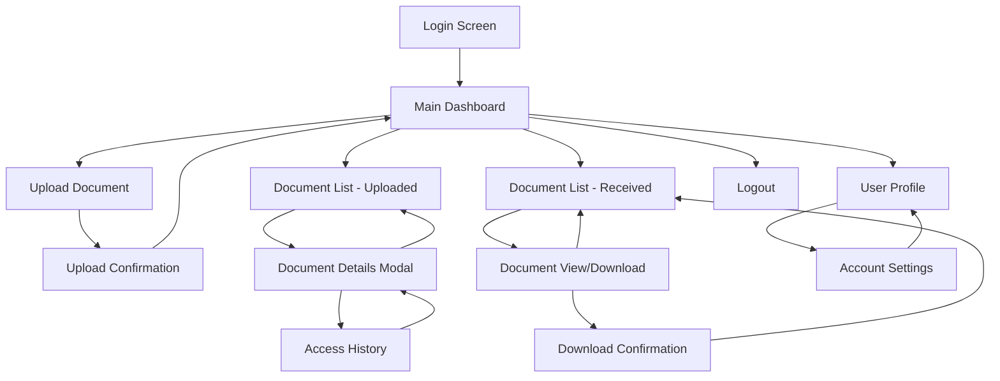
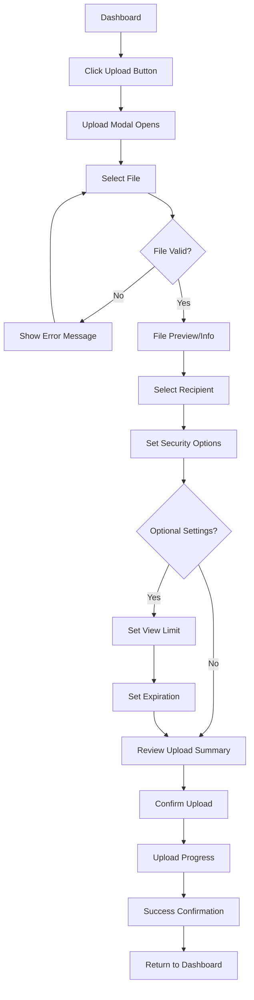
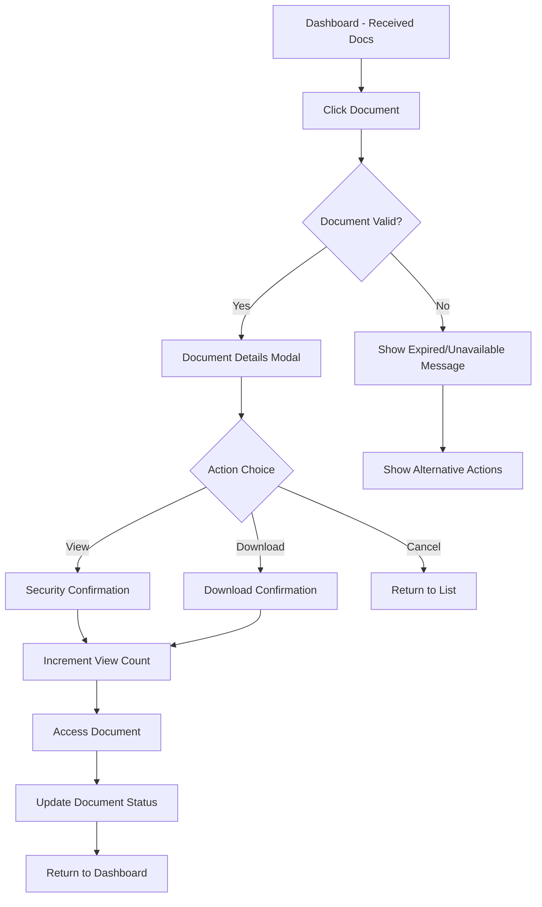
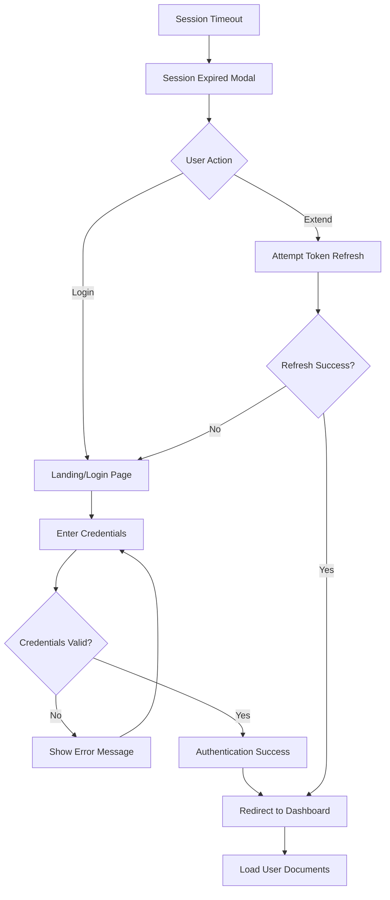

# Secure Document Delivery System UI/UX Specification

## Introduction

This document defines the user experience goals, information architecture, user flows, and visual design specifications for the Secure Document Delivery System's user interface. It serves as the foundation for Next.js frontend development, ensuring a cohesive, security-focused, and user-centered experience for internal document sharing operations.

### Overall UX Goals & Principles

#### Target User Personas

**Primary User: Corporate Employee**
- Technical comfort level: Intermediate (familiar with standard web applications)
- Primary goals: Securely share sensitive documents with colleagues, track document access
- Pain points: Uncertainty about document security, complex interfaces, unclear access status
- Usage context: Professional environment, time-sensitive document sharing

**Secondary User: Document Recipient**
- Technical comfort level: Basic to Intermediate
- Primary goals: Quickly access assigned documents, understand access limitations
- Pain points: Confusion about document availability, unclear expiration timelines
- Usage context: Occasional use, may access from mobile devices

#### Usability Goals

- **Ease of learning**: New users can upload and share a document within 3 minutes of first login
- **Efficiency of use**: Regular users can complete document upload and assignment in under 90 seconds
- **Error prevention**: Clear validation and confirmation for security-sensitive actions
- **Memorability**: Infrequent users can return and complete tasks without relearning interface
- **Security confidence**: Users feel assured that their documents are protected and access is controlled

#### Design Principles

1. **Security transparency over security obscurity** - Make security features visible and understandable
2. **Progressive disclosure of complexity** - Show essential information first, details on demand
3. **Consistent feedback loops** - Every action has immediate, clear visual response
4. **Trust through clarity** - Eliminate ambiguity in security status and document lifecycle
5. **Professional simplicity** - Clean, corporate-appropriate design that inspires confidence

### Change Log

| Date | Version | Description | Author |
|------|---------|-------------|---------|
| Today | 1.0 | Initial UI/UX specification creation | UX Expert (Sally) |

## Information Architecture (IA)

### Site Map / Screen Inventory

### Navigation Structure

**Primary Navigation:** Top navigation bar with logo, main sections (Dashboard, Upload), user menu
- Dashboard (default landing page)
- Upload Document (primary action)
- User Profile dropdown (Profile, Settings, Logout)

**Secondary Navigation:** Tab-based navigation within dashboard
- Uploaded Documents tab
- Received Documents tab

**Breadcrumb Strategy:** Minimal breadcrumbs for modal/detail views only (e.g., Dashboard > Document Details)

## User Flows

### Document Upload Flow

**User Goal:** Upload a document and assign it to a recipient with security settings

**Entry Points:** Upload button from dashboard, quick upload action

**Success Criteria:** Document successfully uploaded, encrypted, and assigned with confirmation

#### Flow Diagram

#### Edge Cases & Error Handling
- **File too large**: Clear error message with size limit and suggestions
- **Invalid file type**: Explanation of accepted formats
- **No recipients available**: Graceful messaging with admin contact
- **Network failure**: Retry mechanism with progress preservation
- **Duplicate recipient selection**: Prevention with clear feedback

**Notes:** Upload process emphasizes security at each step with clear visual indicators

### Document Access Flow

**User Goal:** View or download a document assigned to them

**Entry Points:** Document list, direct link notification

**Success Criteria:** Document successfully accessed with usage tracking

#### Flow Diagram

#### Edge Cases & Error Handling
- **Document expired**: Clear expiration message with context
- **View limit reached**: Explanation with sender contact option
- **Access denied**: Security message without revealing document details
- **Download failure**: Retry mechanism with technical support contact

**Notes:** Security confirmations prevent accidental access count consumption

### Authentication Flow

**User Goal:** Securely log into the system

**Entry Points:** Application URL, session expiration

**Success Criteria:** Authenticated access to dashboard

#### Flow Diagram

#### Edge Cases & Error Handling
- **Invalid credentials**: Clear error without revealing which field was incorrect
- **Account locked**: Informative message with admin contact
- **Network issues**: Offline message with retry mechanism
- **Session expiration**: Graceful prompt to re-authenticate

**Notes:** Security-focused authentication with clear but non-revealing error messages

## Wireframes & Mockups

### Primary Design Files
**Design Tool:** Figma workspace for detailed mockups and component specifications
**Design File Link:** [To be created during development phase]

### Key Screen Layouts

#### Login Screen
**Purpose:** Secure authentication entry point

**Key Elements:**
- Centered login form with email/password fields
- Company logo and security messaging
- "Remember me" checkbox with security explanation
- Professional background with subtle security iconography

**Interaction Notes:** Form validation on blur, clear error messaging below fields

**Design File Reference:** [Login screen Figma frame]

#### Main Dashboard
**Purpose:** Central hub for document management and status overview

**Key Elements:**
- Top navigation with upload button and user menu
- Document statistics cards (uploaded count, received count, expiring soon)
- Tabbed interface for uploaded vs received documents
- Document list with status indicators and quick actions
- Empty states with helpful guidance for new users

**Interaction Notes:** Tab switching preserves scroll position, infinite scroll for large lists

**Design File Reference:** [Dashboard Figma frame]

#### Document Upload Modal
**Purpose:** Guided document upload with security configuration

**Key Elements:**
- Drag-and-drop file area with browse button
- File preview with metadata display
- Recipient selection dropdown with search
- Security settings section (view limit, expiration)
- Progress bar and confirmation messaging

**Interaction Notes:** Real-time validation, progressive disclosure of options

**Design File Reference:** [Upload modal Figma frame]

#### Document List Item
**Purpose:** Display document information with status and actions

**Key Elements:**
- Document title and description
- Sender/recipient information
- Security status badges (active, expiring, expired)
- View count and limit indicators
- Action buttons (view, download, details)

**Interaction Notes:** Hover states reveal additional information, status color coding

**Design File Reference:** [List item component Figma frame]

## Component Library / Design System

### Design System Approach
**Custom Design System** built specifically for security-focused document management, emphasizing trust, clarity, and professional appearance suitable for corporate environments.

### Core Components

#### Security Status Badge
**Purpose:** Clearly communicate document security status and urgency

**Variants:**
- Active (green): Document available for access
- Expiring Soon (amber): Less than 24 hours remaining
- Expired (red): No longer accessible
- View Limited (blue): Approaching view limit

**States:** Default, hover (shows tooltip with details)

**Usage Guidelines:** Always accompany with descriptive text, use consistent color coding throughout application

#### Document Card
**Purpose:** Display document information in list and grid views

**Variants:**
- Uploaded Document: Shows recipient and delivery status
- Received Document: Shows sender and access information
- Compact: Minimal information for dense lists

**States:** Default, hover (elevated shadow), selected, disabled (expired)

**Usage Guidelines:** Maintain consistent information hierarchy, ensure touch targets meet accessibility requirements

#### Security Progress Indicator
**Purpose:** Show remaining views or time until expiration

**Variants:**
- View Count: Circular progress showing remaining views
- Time Remaining: Linear progress with time display
- Combined: Both metrics when applicable

**States:** Normal, warning (low remaining), critical (very low)

**Usage Guidelines:** Use warning colors sparingly, provide context through labels

#### Upload Zone
**Purpose:** File selection and upload progress display

**Variants:**
- Empty: Drag-and-drop area with instructions
- File Selected: Preview with file information
- Uploading: Progress bar with cancel option
- Complete: Success state with next steps

**States:** Default, drag over, error, disabled

**Usage Guidelines:** Clear visual feedback for all states, support keyboard navigation

## Branding & Style Guide

### Visual Identity
**Brand Guidelines:** Professional corporate identity emphasizing security, trust, and efficiency

### Color Palette

| Color Type | Hex Code | Usage |
|------------|----------|-------|
| Primary | #2563EB | Primary actions, links, brand elements |
| Secondary | #64748B | Secondary text, supporting elements |
| Accent | #0891B2 | Interactive elements, focus states |
| Success | #059669 | Active documents, successful actions |
| Warning | #D97706 | Expiring soon, cautionary states |
| Error | #DC2626 | Expired documents, error states |
| Neutral-50 | #F8FAFC | Background, card surfaces |
| Neutral-100 | #F1F5F9 | Border colors, dividers |
| Neutral-900 | #0F172A | Primary text, headers |

### Typography

#### Font Families
- **Primary:** Inter (clean, professional, excellent readability)
- **Secondary:** Inter (consistent throughout for simplicity)
- **Monospace:** JetBrains Mono (for technical information, IDs)

#### Type Scale

| Element | Size | Weight | Line Height |
|---------|------|--------|-------------|
| H1 | 2rem (32px) | 700 (Bold) | 1.2 |
| H2 | 1.5rem (24px) | 600 (Semi-bold) | 1.3 |
| H3 | 1.25rem (20px) | 600 (Semi-bold) | 1.4 |
| Body | 1rem (16px) | 400 (Regular) | 1.5 |
| Small | 0.875rem (14px) | 400 (Regular) | 1.4 |

### Iconography

**Icon Library:** Lucide React (consistent, professional icon set)

**Usage Guidelines:** 
- Use outline style for consistency
- 16px and 24px sizes for UI elements
- Maintain 2px stroke width
- Security-focused icons: Shield, Lock, Eye, Download, Upload

### Spacing & Layout

**Grid System:** 8px base unit with 4px variants for fine-tuning

**Spacing Scale:** 4px, 8px, 12px, 16px, 24px, 32px, 48px, 64px

## Accessibility Requirements

### Compliance Target
**Standard:** WCAG 2.1 Level AA compliance for corporate accessibility standards

### Key Requirements

**Visual:**
- Color contrast ratios: 4.5:1 for normal text, 3:1 for large text
- Focus indicators: 2px solid outline with high contrast color
- Text sizing: Minimum 16px for body text, scalable to 200%

**Interaction:**
- Keyboard navigation: Full functionality accessible via keyboard
- Screen reader support: Semantic HTML with proper ARIA labels
- Touch targets: Minimum 44px for interactive elements

**Content:**
- Alternative text: Descriptive alt text for all informative images
- Heading structure: Logical heading hierarchy (h1, h2, h3)
- Form labels: Clear, associated labels for all form inputs

### Testing Strategy
Regular accessibility auditing using axe-core, manual keyboard testing, and screen reader verification with NVDA/JAWS

## Responsiveness Strategy

### Breakpoints

| Breakpoint | Min Width | Max Width | Target Devices |
|------------|-----------|-----------|----------------|
| Mobile | 320px | 767px | Smartphones |
| Tablet | 768px | 1023px | Tablets, small laptops |
| Desktop | 1024px | 1439px | Standard desktops |
| Wide | 1440px | - | Large monitors |

### Adaptation Patterns

**Layout Changes:**
- Mobile: Single column layout with collapsible navigation
- Tablet: Maintain desktop layout with adjusted spacing
- Desktop: Full multi-column layout with optimal spacing

**Navigation Changes:**
- Mobile: Hamburger menu with slide-out navigation
- Tablet/Desktop: Horizontal navigation bar with dropdowns

**Content Priority:**
- Mobile: Essential actions prominent, secondary features in overflow menus
- Tablet/Desktop: Full feature visibility with contextual organization

**Interaction Changes:**
- Mobile: Touch-optimized targets (minimum 44px), swipe gestures
- Desktop: Hover states, keyboard shortcuts, precise cursor interactions

## Animation & Micro-interactions

### Motion Principles
Subtle, purposeful animations that enhance security confidence and provide clear feedback without distracting from core functionality

### Key Animations

- **Upload Progress**: Smooth progress bar with fade-in completion message (Duration: Variable, Easing: ease-out)
- **Status Transitions**: Color fade transitions for document status changes (Duration: 200ms, Easing: ease-in-out)
- **Modal Appearances**: Scale and fade-in for modal dialogs (Duration: 150ms, Easing: ease-out)
- **Security Confirmations**: Gentle pulse animation for security-related buttons (Duration: 1000ms, Easing: ease-in-out)
- **Error States**: Subtle shake animation for validation errors (Duration: 300ms, Easing: ease-in-out)
- **Success Feedback**: Check mark animation with scale effect (Duration: 400ms, Easing: ease-out)

## Performance Considerations

### Performance Goals
- **Page Load:** First contentful paint under 1.5 seconds
- **Interaction Response:** UI feedback within 100ms of user action
- **Animation FPS:** Maintain 60fps for all animations and transitions

### Design Strategies
Optimize for Next.js rendering patterns, minimize large images, use efficient icon sprites, implement progressive loading for document lists, leverage browser caching for design assets

## Next Steps

### Immediate Actions
1. Create detailed Figma mockups for all identified screens and components
2. Develop component specifications with detailed interaction patterns
3. Create responsive breakpoint mockups for key user flows
4. Establish design token system for consistent implementation

### Design Handoff Checklist
- [x] All user flows documented with edge cases
- [x] Component inventory complete with variants and states
- [x] Accessibility requirements defined with specific criteria
- [x] Responsive strategy clear with breakpoint specifications
- [x] Brand guidelines incorporated with security-focused approach
- [x] Performance goals established with measurable targets

## Checklist Results
*To be populated after UX/UI checklist validation*